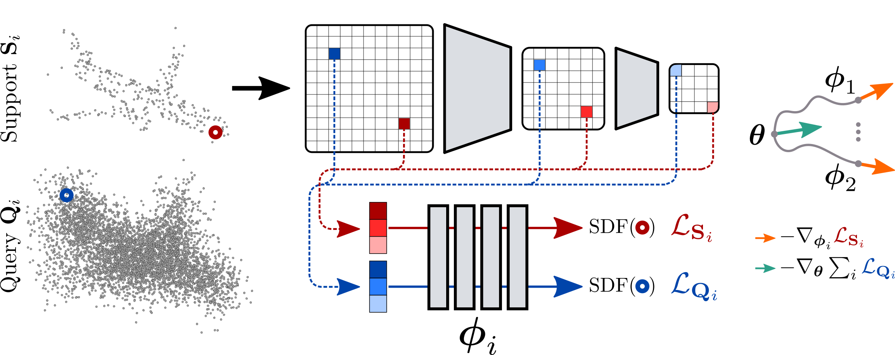

# Few 'Zero Level Set'-Shot Learning of Shape Signed Distance Functions in Feature Space
  Amine Ouasfi, Adnane Boukhayma. [ECCV 2022](https://arxiv.org/abs/2207.04161) 



# Install 

Please follow the instructions detailed in [IF-Net](). Then,  install the required  packages for this project by running:
```
pip install requirements.txt
```
# Data Preparation

The data preparation process is the same as in [IF-Net](). 

To generate ground truth Signed distance values instead of occupancies run:
```
python data_processing/boundary_sampling_sdf.py -sigma 0.1
python data_processing/boundary_sampling_sdf.py -sigma 0.01
```
## Training
 To start a training please run  the following command:
 ````
 python train.py -res 128 -pc_samples 3000 -epochs 100 -inner_steps 5 -batch_size 8

  ````
  You can add the following  options `-p_enc` and `_p_dec` to initialize the encoder and/or the decoder with a pretrained model. Also, you can freeze the encoder during the training by adding the option  `-freeze` to your command. 

## Generation

The command:

````
python generate.py -res 128 -pc_samples 3000 -batch_size 8 -inner_steps 5 -exp <exp_name> -checkpoint <checkpoint>  
````
Where `exp_name` is the path to the folder containing the trained model checkpoints.

## Evaluation 
The evaluation process is the same as in [IF-Net](). 
